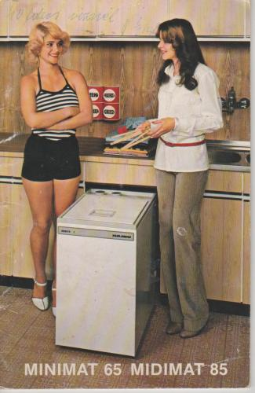

# HAJDU Energo-Smart - 2017

## Concept
The purpose is to refactor a HAJDU EnergoLux 751.2 electromechanical wash machine designed in the 80's achieving the following goals:

- The existing electromechanical controller will be replaced with a microcontroller based one;
- In addition to the original washing programs designed by the factory of the wash machine new washing programs will be defined and added, furthermore, custom washing programs can be stored, as well;
- A colour graphical user interface will be provided by the wash machine to allow the user to see the details of the washing programs, and to display useful information about the statuses of the machine;
- The wash machine displays the duration and the remaining time of the selected program;
- Offering such washing programs which allows regular termination of the current program before it ends;
- The wash machine continuously measures, logs and displays consumption data, e.g. current, water consumption. Cost report and statistics can be calculated and displayed to the user based on these data;
- It provides audible signals for the different statuses (program starting, ending, etc.).
- Supporting WIFI which allows remote access, querying the status and controlling the wash machine using WIFI capable mobiel devices.

## Architecture

### 1. Washmachine Electromechanic Resources (WER)
----------------------------------------------
The resources of the original wash machine like wash machine and spinning motors, pump motor, electromechanical latch, flushing and magnet valves, heating elements, interference filter condensators, water level and temperature sensors, flow meter (not original part), etc.

#### Switches

   B1  - Changing the direction of the washing motor
   B2  - Starting the washing motor (B3 before, B4 must be turned off)
   B3  - Motor condensator wash machine or spin 1
   B4  - Motor condensator wash machine or spin 2
   B5  - Starting the spin (B3 before, B4 must be switched)
   B6  - Starting the pump
   B7  - Switching the latch
   B8  - Switching the flushing valve
   B9  - Starting the magnet valve (water feeding)
   B10 - Switching the 700 W heating pad
   B11 - Switching the 1200 W heating pad

#### Sensors

   F5A - T>36C temperature sensor
   F5B - T>55C temperature sensor
   F5C - T>85C temperature sensor
   FA  - Water level sensor (low)
   FK  - Water level sensor (middle)
   FM  - Water level sensor (high)
   FPWR - "Resources under voltage" sensor (0-5V)

### 2. Washmachine Control Unit (WCU)
---------------------------------
It is responsible for the control of wash machine resources, storing and running washing programs and managing security features. It provides the control thorugh relays.

#### Outputs

   B1..B11 = 11 output for switching the resources of the WER (in optimized way)
   SW1 = 1 output for the main current swith relay (in optimized way)
   WCU_INT = WCU event signal interrupt

   Summary: 12 digital outputs

#### Inputs

   F5A, F5B, F5C = Temperature level sensors (3 digital inputs)
   FA, FK, FM = Water level sensors (3 digital inputs)
   UD1 = System under voltage detector sensor
   UD2 = Water temperature overrun detector sensor
   FRD = Water flow through sensor (EXT INT)
   ACS = AC current sensor analog input

   Summary: 9 digital inputs, 1 analog input

#### Communication

   I2C interface (SDA, SCL)

   WCU RESET = Full voltage releif of the electric systems of the wash machine

### 3. Smart-Interface Control Unit (SCU)

It is responsible for the implementation of the user interface, for the selection of the washing programs, starting and stopping the washing programs, displaying status informations, generating sound effects. It runs the measuring programs and the related calculations. Ensures the WIFI interface and the communication with other devices.

#### Inputs
   - pushbuttons (6 pcs): POWER, START/STOP, +, -, SELECT, RETURN
   - WCU_INT

#### Outputs
   - pushbutton LEDs (6 pcs)

#### I2C
   - RTC module, WCU

#### RxTx
   - WIFI module

#### Comment

The WCU and SCU are galvanically insulated from the WER and from other elements which are mains voltage connected.
